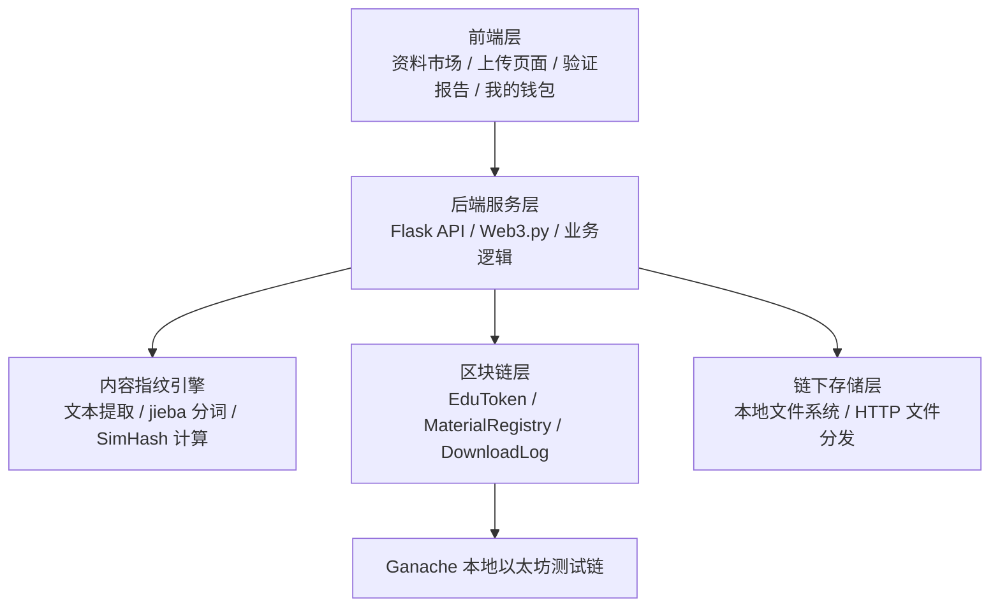
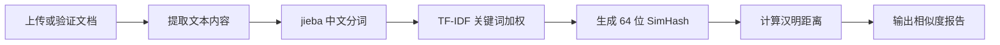
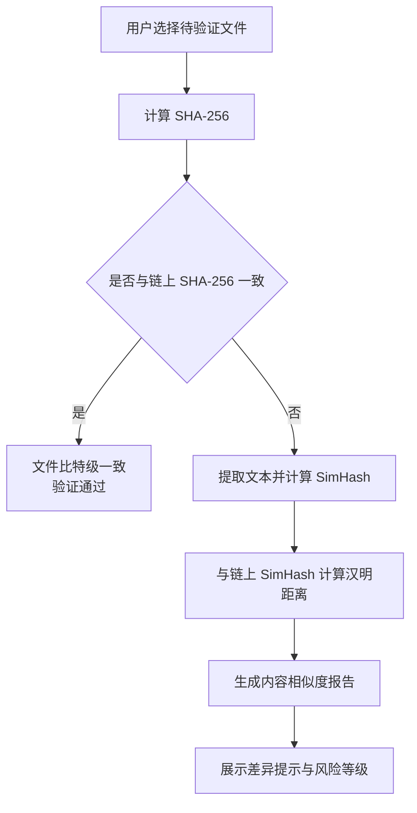
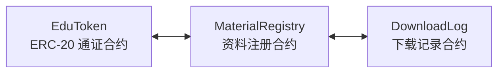
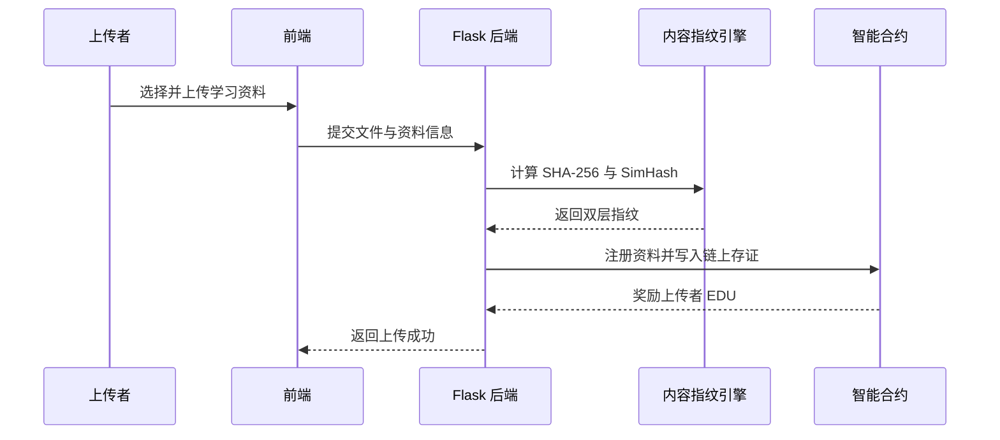
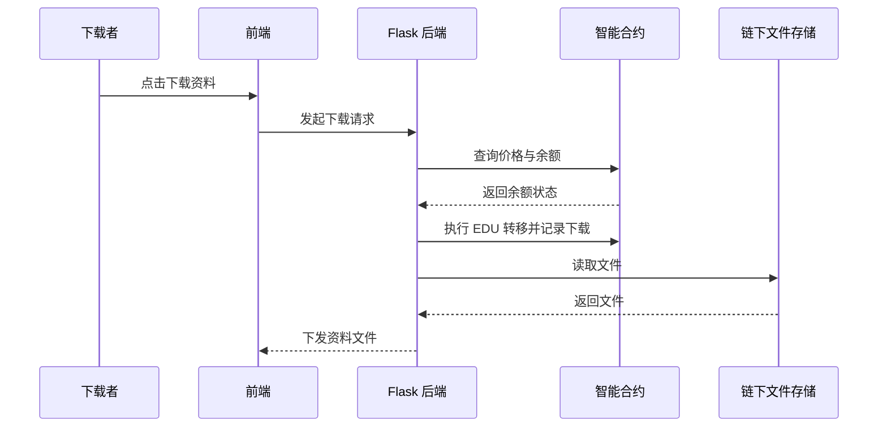
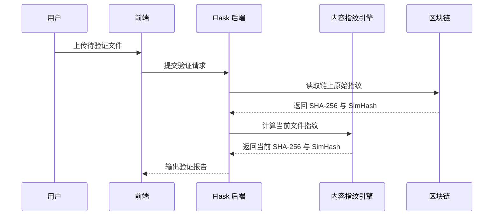

# EduChain  
## 面向校园学习资料共享的区块链可信分发原型系统

<p align="center">
  
  
  
  
  
</p>

<p align="center">
  <b>内容级防篡改验证 × 通证激励资源交换</b><br/>
  一个面向校园学习资料共享场景的区块链可信分发原型系统
</p>

---

## 1. 项目简介

**EduChain** 是一个面向校园学习资料共享场景的区块链可信分发原型系统。

在传统校园资料共享中，学生通常依赖网盘、QQ群文件、微信群转发等方式传播课件、笔记、试卷和复习资料。这类方式虽然使用方便，但存在两个明显问题：

一方面，资料经过多次转发后，文件内容可能被修改，接收者很难判断自己下载的资料是否仍然是原始版本。传统的 SHA-256 哈希只能判断文件是否完全一致，无法进一步说明“内容到底改了多少”。

另一方面，资料共享缺乏持续激励。上传者需要花时间整理和上传资料，但下载者往往只消费不贡献，容易造成“大家都想下载，但没人愿意上传”的搭便车问题。

因此，EduChain 将系统核心定位为：

> 通过区块链存证保证资料来源可信，通过内容感知哈希识别资料篡改程度，通过通证机制激励用户持续贡献高质量学习资源。

---

## 2. 核心目标

EduChain 不是一个普通的文件上传下载系统，而是围绕“可信共享”和“可持续交换”设计的校园资料分发系统。

系统希望解决三个问题：

1. **资料是否可信**  
   通过区块链记录资料指纹、上传者、版本和下载行为，使资料来源和流转过程可追溯。

2. **资料是否被篡改**  
   通过 SHA-256 与 SimHash 双层指纹机制，既能判断文件是否完全一致，也能判断内容相似度和可能的篡改程度。

3. **用户为什么愿意上传资料**  
   通过 EduToken 通证机制，让上传资料、被下载、持续贡献等行为获得积分奖励，形成“贡献—收益—消费”的资源交换闭环。

---

## 3. 系统亮点

### 3.1 双层内容指纹验证

EduChain 采用 **SHA-256 + SimHash** 的双层指纹体系。

| 指纹类型 | 作用 | 特点 |
| :--- | :--- | :--- |
| SHA-256 | 判断文件是否比特级完全一致 | 精确、严格，但只能得到“一样/不一样” |
| SimHash | 判断文档内容相似度 | 可量化差异，适合识别轻微修改、格式转换、衍生版本 |

当文件 SHA-256 不一致时，系统会继续计算文档文本内容的 SimHash，通过汉明距离判断资料是否只是被轻微编辑、格式转换，还是已经发生较大篡改。

### 3.2 内容级篡改检测

系统不仅能告诉用户“文件变了”，还可以进一步给出：

- 文件是否与原始资料完全一致；
- 内容相似度百分比；
- SimHash 汉明距离；
- 是否属于轻微编辑、衍生版本或差异较大版本；
- 可选展示新增/缺失关键词，辅助定位改动内容。

这使系统从传统的“文件完整性校验”升级为“内容级可信验证”。

### 3.3 EduToken 通证激励

EduChain 引入 **EduToken（EDU）** 作为系统内部学习积分通证。

通证不涉及真实货币，仅用于系统内部的资源交换和贡献激励：

| 用户行为 | EDU 变化 | 说明 |
| :--- | :--- | :--- |
| 用户注册 | +100 EDU | 冷启动奖励 |
| 上传资料 | +20 EDU | 鼓励贡献资料 |
| 资料被下载 | 上传者 +5 EDU | 按下载次数激励优质资料 |
| 下载资料 | 下载者 -5 EDU | 建立资源消费成本 |
| 举报抄袭且确认 | 上传者 -50 EDU | 抑制低质量或抄袭内容 |

通过这种机制，系统从单向“资料分发”变成双向“可信资源交换”。

---

## 4. 技术栈

| 层次 | 技术选型 | 说明 |
| :--- | :--- | :--- |
| 前端层 | HTML / CSS / JavaScript / Vue 可选 | 资料市场、上传页面、验证报告、钱包页面 |
| 后端服务层 | Python + Flask | 业务接口、文件处理、内容指纹计算、链上交互 |
| 区块链交互 | Web3.py | 后端调用智能合约、读取链上记录 |
| 智能合约 | Solidity | 实现资料注册、通证转移、下载记录存证 |
| 测试链 | Ethereum + Ganache | 本地以太坊测试环境 |
| 内容提取 | python-pptx / python-docx / PyPDF2 | 提取 PPT、Word、PDF 文本内容 |
| 中文分词 | jieba + TF-IDF | 提取关键词并计算内容权重 |
| 内容指纹 | SimHash 64 位 | 计算文档内容感知哈希 |
| 容器化部署 | Docker Compose | 一键启动前端、后端、Ganache 等服务 |

---

## 5. 系统总体架构

EduChain 采用四层架构设计：



### 架构说明

- **前端层**  
  面向用户展示资料列表、上传入口、下载按钮、完整性验证结果和通证余额。

- **后端服务层**  
  负责用户操作处理、文件上传下载、内容指纹计算、通证逻辑封装以及区块链交互。

- **内容指纹引擎**  
  负责从文档中提取文本，完成中文分词、关键词加权、SimHash 计算和相似度判定。

- **区块链层**  
  通过智能合约记录资料注册信息、通证变化和下载行为，实现可信存证。

- **链下存储层**  
  文件本体不直接上链，而是存储在本地文件系统或文件服务中，链上只保存哈希、指纹和元数据。

---

## 6. 核心模块

### 6.1 用户管理模块

用户管理模块负责系统基础身份管理，包括用户注册、登录、学号信息、通证余额展示等功能。

用户注册后，系统会为其发放初始 EduToken，用于后续下载资料或参与资源交换。

---

### 6.2 资料上传模块

资料上传模块是系统的核心入口之一。

用户上传 PPT、Word 或 PDF 文件后，系统会自动完成以下操作：

1. 保存文件到链下存储；
2. 计算文件的 SHA-256 精确哈希；
3. 提取文档文本内容；
4. 计算文档 SimHash 内容指纹；
5. 将资料元数据与双层指纹写入区块链；
6. 向上传者发放 EDU 奖励。

---

### 6.3 内容指纹引擎

内容指纹引擎用于实现文档内容级防篡改验证。

其基本流程如下：



系统根据 SimHash 汉明距离判断内容相似度：

| 汉明距离 d | 判定结果 | 含义 |
| :--- | :--- | :--- |
| d = 0 | 内容高度一致 | 文本内容基本无变化 |
| d ≤ 3 | 高度相似 | 可能存在轻微编辑 |
| 4 ≤ d ≤ 10 | 明显改动 | 可能属于衍生版本 |
| d > 10 | 差异较大 | 可能不是同一资料 |

---

### 6.4 完整性验证模块

完整性验证模块用于用户下载资料后的可信校验。

系统验证流程如下：



该模块是答辩演示中最能体现技术深度的部分，能够直观展示系统相较普通文件哈希校验的改进。

---

### 6.5 资料市场与下载模块

资料市场用于展示系统中的学习资料，包括：

- 资料名称；
- 所属课程；
- 上传者；
- 通证价格；
- 下载次数；
- 验证状态；
- 上传时间。

用户下载资料时，系统会检查其 EDU 余额。若余额充足，则调用合约完成通证转移，并下发文件；若余额不足，则提示用户通过上传资料获取通证。

---

### 6.6 通证管理模块

通证管理模块用于展示用户的 EduToken 余额、收入记录和支出记录。

典型记录包括：

- 注册奖励；
- 上传奖励；
- 资料被下载收入；
- 下载资料支出；
- 举报惩罚；
- 活跃贡献奖励。

该模块让用户能够清楚看到自己的贡献和资源消费情况。

---

### 6.7 链上追溯模块

链上追溯模块用于展示资料注册、下载行为和通证流转记录。

系统可以通过交易 ID 或资料 ID 查询链上记录，使资料共享过程具备可追溯性和可验证性。

---

## 7. 智能合约设计

EduChain 采用三类核心合约协作。



### 7.1 EduToken 合约

EduToken 合约负责系统内部通证的发行、转账、奖励和惩罚。

核心功能包括：

- `mint()`：铸造通证；
- `transfer()`：用户之间转移通证；
- `balanceOf()`：查询余额；
- `reward()`：奖励上传者；
- `penalize()`：惩罚违规上传者。

---

### 7.2 MaterialRegistry 合约

MaterialRegistry 合约负责资料注册和资料信息查询。

核心字段包括：

| 字段 | 含义 |
| :--- | :--- |
| id | 资料编号 |
| name | 资料名称 |
| uploader | 上传者地址 |
| sha256Hash | 文件精确哈希 |
| simHash | 文档内容指纹 |
| price | 下载价格 |
| version | 资料版本 |
| deleted | 是否被软删除 |
| timestamp | 上传时间 |

---

### 7.3 DownloadLog 合约

DownloadLog 合约负责记录资料下载行为。

核心记录包括：

| 字段 | 含义 |
| :--- | :--- |
| materialId | 被下载资料 ID |
| downloader | 下载者地址 |
| timestamp | 下载时间 |
| result | 下载是否成功 |
| tokensTransferred | 转移的通证数量 |

---

## 8. 典型使用流程

### 8.1 上传资料流程



---

### 8.2 下载资料流程



---

### 8.3 篡改验证流程



---

## 9. 页面设计

### 9.1 资料市场页

资料市场页是系统首页，主要展示校园学习资料列表。

页面内容包括：

- 顶部导航栏；
- 当前用户学号；
- EDU 余额；
- 上传资料按钮；
- 课程筛选；
- 搜索框；
- 资料卡片网格；
- 下载入口。

---

### 9.2 上传资料页

上传资料页用于提交新的学习资料。

页面内容包括：

- 文件选择区域；
- 资料名称；
- 所属课程；
- 资料简介；
- 是否免费；
- 下载价格；
- 上传按钮；
- 上传后指纹计算结果展示。

---

### 9.3 验证报告页

验证报告页是 EduChain 的核心展示页面。

页面内容包括：

- SHA-256 精确校验结果；
- SimHash 内容相似度；
- 汉明距离；
- 风险等级；
- 新增关键词；
- 缺失关键词；
- 链上存证信息。

示例报告：

```text
SHA-256 校验：不一致
SimHash 相似度：92.1%
汉明距离：5
系统判断：文件内容有明显改动，可能属于原资料的衍生版本
```

---

### 9.4 我的钱包页

我的钱包页用于展示用户的 EDU 通证情况。

页面内容包括：

- 当前余额；
- 收入记录；
- 支出记录；
- 下载消费统计；
- 上传收益统计；
- 活跃贡献奖励记录。

---

### 9.5 链上追溯页

链上追溯页用于展示资料相关的链上记录。

页面内容包括：

- 资料注册交易；
- 上传者地址；
- 文件哈希；
- SimHash；
- 下载记录；
- 通证流转记录；
- Ganache 区块信息。

---

## 10. 项目演示重点

EduChain 的答辩演示建议围绕“可信验证”和“通证流转”展开。

### 演示一：用户注册

展示两个用户注册系统，并分别获得 100 EDU 初始通证。

### 演示二：上传资料

用户 A 上传一份 PPT。系统计算 SHA-256 和 SimHash，并将资料指纹写入链上。上传完成后，用户 A 获得 20 EDU 奖励。

### 演示三：下载资料

用户 B 下载用户 A 上传的资料。系统扣除用户 B 的 5 EDU，并将 5 EDU 转移给用户 A。同时记录下载行为。

### 演示四：篡改检测

准备一份被修改过的 PPT 副本，上传到系统中进行验证。

系统应展示：

- SHA-256 不匹配；
- SimHash 相似度约为 90% 以上；
- 判断该文件可能是原资料的衍生版本；
- 展示新增或缺失关键词。

### 演示五：链上追溯

展示资料注册、下载记录和通证转移在 Ganache 区块链中的记录，体现系统的可信存证能力。

---

## 11. 项目价值

EduChain 的价值主要体现在三个方面：

### 11.1 技术价值

系统将区块链存证、内容感知哈希、通证激励机制结合起来，不只是简单地“把文件哈希上链”，而是进一步解决了内容级篡改识别和资源共享激励问题。

### 11.2 场景价值

EduChain 面向校园资料共享这一具体场景，问题真实、边界清晰，适合做成本科阶段可落地的原型系统。

### 11.3 展示价值

系统具备较强的答辩展示效果：

- 可以现场上传文件；
- 可以展示通证余额变化；
- 可以展示文件被篡改后的相似度报告；
- 可以展示链上交易记录；
- 可以体现区块链在可信分发中的实际作用。

---

## 12. 项目关键词

`区块链` `可信分发` `校园资料共享` `SimHash` `SHA-256` `Flask` `Python` `Solidity` `EduToken` `ERC-20` `Ganache` `Web3.py` `Docker Compose`

---

## 13. 项目定位总结

EduChain 是一个面向校园学习资料共享的可信分发原型系统。

它通过 **SHA-256 + SimHash** 实现资料内容级防篡改验证，通过 **Solidity 智能合约 + EduToken 通证机制** 实现资源交换激励，通过 **Flask + Web3.py** 完成链下业务与链上存证的连接。

相比普通网盘或文件分享系统，EduChain 的核心特点不是“能上传下载资料”，而是：

> 能证明资料从哪里来、有没有被改、改动程度有多大，并让真正贡献资料的人获得持续激励。

