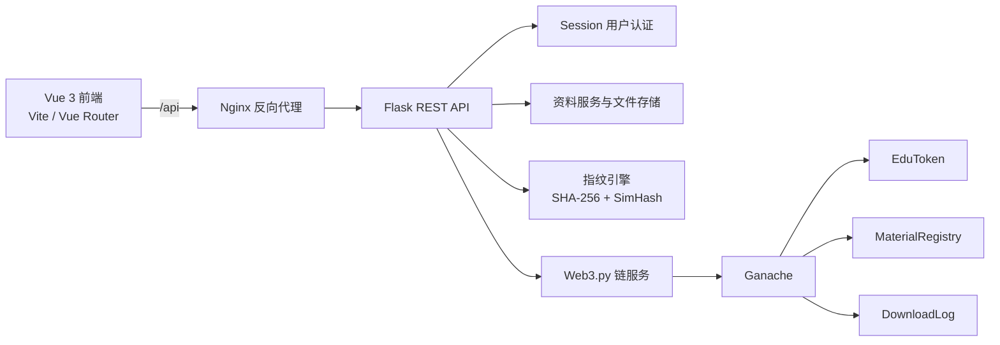

# EduChain

## 校园学习资料可信交换与区块链存证平台

EduChain 是一个面向高校教学实验场景的区块链应用原型，用于完成学习资料上传、链上存证、可信验证、付费下载、EDU 通证激励和审计追溯。

项目已融合 Vue 3 前端设计与可运行验证分支：保留西南交通大学品牌视觉、七个主要业务页面和整体设计方案，同时接入 Flask REST API、Ganache、智能合约、Docker Compose 与自动化测试。

> 当前定位：可运行、可验证、可演示的课程设计原型，不适合直接用于生产环境。

## 当前状态

更新时间：2026-06-13

| 模块 | 状态 | 说明 |
| :--- | :---: | :--- |
| 智能合约 | 已完成 | `EduToken`、`MaterialRegistry`、`DownloadLog` 可编译并自动部署到 Ganache |
| 内容指纹 | 已完成 | 支持 SHA-256 完整性校验与 256 位 SimHash 内容相似度检测 |
| Flask 后端 | 已完成 | 认证、资料、通证、审计、健康检查 API 已接入 |
| Vue 前端 | 已联调 | 七个设计页面已接入真实 Session、资料、文件、钱包和链状态 API |
| Docker 部署 | 已验证 | Ganache、Flask、Vue/Nginx 可通过 Compose 一键构建启动 |
| 自动化测试 | 已接入 | 前端回归、后端单元测试与链上能力测试均已保留 |

已验证访问地址：

- Vue 前端：`http://localhost:8080`
- 后端健康检查：`http://localhost:5000/api/health`
- Ganache RPC：`http://localhost:8545`

## 前端设计

前端使用 Vue 3、Vue Router、Pinia 和 Vite。页面延续 `main` 分支的整体方案：

- 西南交通大学蓝色品牌体系、校徽与 EduChain 视觉资产。
- 登录页采用品牌说明、功能价值和连接状态组合布局。
- 业务页面采用固定侧栏、顶部用户区、卡片和数据表格组成的后台系统布局。
- 统一使用资料、链状态、钱包、审计和验证语义，避免普通网盘式表达。
- 详细颜色、排版与组件约束见 `frontend/DESIGN_SYSTEM.md`。

| 路由 | 页面 | 已接入能力 |
| :--- | :--- | :--- |
| `/login` | 登录系统 | Session 登录、错误提示、后端及链连接检查 |
| `/market` | 资料市场 | 链上资料列表、搜索筛选、详情、下载、验证跳转 |
| `/upload` | 上传资料 | 文件校验、策略和价格配置、指纹计算、链上登记、相似资料 |
| `/verify` | 文件验证 | SHA-256、SimHash、汉明距离、相似度和关键词差异 |
| `/wallet` | 我的钱包 | 实时余额、链上流水、收入支出统计、EDU 转账 |
| `/audit` | 审计追溯 | 我的下载、我的上传、按资料 ID 查询下载记录 |
| `/status` | 系统状态 | 后端、Ganache、区块、合约地址和数据统计 |

## 系统架构



Docker 启动时，后端入口脚本会等待 Ganache 就绪，检查合约地址；合约不存在或失效时自动执行 `scripts/deploy.py`，随后启动 Flask。

## 核心功能

### 资料可信存证

- 上传 PDF、DOCX、PPTX、TXT、MD 文件。
- 计算 SHA-256，判断文件字节是否完全一致。
- 提取文本并生成 256 位 SimHash，判断内容相似程度。
- 将资料 ID、上传者、哈希、内容指纹、价格、版本和访问策略登记到链上。

### 文件验证

| 判断依据 | 用途 |
| :--- | :--- |
| SHA-256 | 判断文件是否被修改 |
| SimHash | 判断内容是否高度相似或属于衍生版本 |
| 汉明距离 | 量化两个 SimHash 之间的差异 |

分类规则：

| 汉明距离 | 分类 |
| :--- | :--- |
| `0` | 完全一致 |
| `1-12` | 高度相似 |
| `13-40` | 衍生版本 |
| `>40` | 差异较大 |

### EDU 通证

- 首次登录且余额为零时奖励 100 EDU。
- 成功上传资料奖励 20 EDU。
- 下载他人资料时由下载者向上传者支付 EDU。
- 支持余额查询、转账、铸造、销毁和链上交易历史。
- EDU 使用整数积分，`decimals()` 返回 `0`。

### 权限与审计

- Flask Session 保存登录态，Vue Router 保护业务页面。
- 下载前检查登录态、访问策略、余额和服务端文件完整性。
- 下载记录通过 `DownloadLog` 合约保存，可按资料或用户地址查询。
- 访问策略支持公开、同课程和预留白名单类型。

## 技术栈

| 层次 | 技术 |
| :--- | :--- |
| 前端 | Vue 3、Vue Router、Pinia、Vite、原生 CSS |
| 后端 | Python 3、Flask、Flask-CORS |
| 区块链交互 | Web3.py |
| 智能合约 | Solidity、OpenZeppelin |
| 本地测试链 | Ganache，Chain ID `1337` |
| 内容处理 | PyPDF2、python-docx、python-pptx、jieba |
| 部署 | Docker Compose、Nginx |

## 项目结构

```text
EduChain/
├── contracts/                 # Solidity 智能合约
├── scripts/                   # 编译、部署和打包脚本
├── backend/
│   ├── app.py                 # Flask 应用入口
│   ├── entrypoint.sh          # 容器等待、部署和启动流程
│   ├── routes/                # auth/material/token/audit API
│   ├── services/              # 用户、链、资料、通证服务
│   ├── fingerprint/           # 文本提取与指纹计算
│   ├── compiled/              # 合约 ABI 与字节码
│   └── tests/                 # 后端测试
├── frontend/
│   ├── src/
│   │   ├── views/             # 七个主要业务页面
│   │   ├── router/            # 路由与会话保护
│   │   ├── stores/            # Pinia 登录态
│   │   ├── utils/api.js       # API、表单和下载封装
│   │   └── assets/            # 样式与品牌图片
│   ├── tests/                 # 前端回归测试
│   ├── DESIGN_SYSTEM.md       # 前端设计规范
│   ├── Dockerfile
│   └── nginx.conf
├── demo/                      # 原始与篡改演示资料
├── docs/                      # 运行、演示和限制说明
├── docker-compose.yml          # 本地开发模式
└── docker-compose.server.yml   # 公网课程测试模式
```

## 快速开始

### Docker Compose

安装并启动 Docker Desktop 后，在项目根目录执行：

```powershell
docker compose up --build -d
```

后端会自动等待 Ganache 并部署或复用合约，不需要手工运行部署脚本。启动完成后打开：

```text
http://localhost:8080
```

查看容器状态和日志：

```powershell
docker compose ps
docker compose logs -f backend
```

停止服务：

```powershell
docker compose down
```

仅在需要清空本地链、上传文件和重新部署合约时执行：

```powershell
docker compose down -v
```

### 演示账号

统一测试密码为 `123456`。

| 账号 | 姓名 | 角色 |
| :--- | :--- | :--- |
| `2023112379` | 唐昊 | 学生 |
| `admin_2023112379` | 唐昊（管理员） | 管理员 |
| `2023112385` | 薛雨凇 | 学生 |
| `2023112380` | 于骐畅 | 学生 |
| `2023112318` | 周子皓 | 学生 |
| `2023112330` | 王东涵 | 学生 |
| `2023116100` | 谢傲宇 | 学生 |
| `2023112392` | 李子彤 | 学生 |
| `2023112317` | 方天宇 | 学生 |

服务器部署、账号课程和联动步骤分别见：

- `docs/SERVER_DEPLOYMENT.md`
- `docs/TEST_ACCOUNT_MANUAL.md`
- `docs/JOINT_TEST_MANUAL.md`

### 本地开发

1. 安装 Node 依赖并编译合约：

```powershell
npm install
npm run compile
```

2. 安装 Python 依赖：

```powershell
python -m venv .venv
.\.venv\Scripts\Activate.ps1
pip install -r requirements.txt
```

3. 启动 Ganache 后部署合约：

```powershell
python scripts/deploy.py
```

4. 启动后端：

```powershell
cd backend
python app.py
```

5. 另开终端启动 Vue：

```powershell
cd frontend
npm install
npm run dev
```

Vite 默认运行在 `http://localhost:5173`，并将 `/api` 代理到 `http://localhost:5000`。

## API 概览

所有接口使用统一响应结构：

```json
{"code": 200, "msg": "success", "data": {}}
```

| 分组 | 主要接口 |
| :--- | :--- |
| 系统 | `GET /api/health` |
| 认证 | `POST /api/auth/register`、`POST /login`、`GET /me`、`POST /logout` |
| 资料 | `POST /api/material/upload`、`GET /list`、`GET /<id>`、`GET /<id>/download`、`POST /verify` |
| 通证 | `GET /api/token/balance`、`GET /history`、`POST /transfer` |
| 审计 | `GET /api/audit/downloads/material/<id>`、`GET /downloads/user/<address>`、`GET /materials/user/<address>`、`GET /full/<id>` |

## 测试

前端设计与 API 接线回归：

```powershell
npm run test:frontend
```

Vue 生产构建：

```powershell
cd frontend
npm run build
```

后端测试：

```powershell
.\.venv\Scripts\python.exe -m unittest discover -s backend\tests -p "test_*.py" -v
```

部分链服务测试需要 Ganache 已启动且合约已部署。

## 当前限制

- 当前是本地 Ganache 原型，不是生产级多节点区块链环境。
- 文件本体存储在链下，链上保存指纹、策略、价格和审计信息。
- 白名单访问策略的数据结构已预留，完整管理界面仍需补充。
- 提交到仓库的 `backend/users.seed.json` 不含密码哈希和私钥；运行时账号保存在被忽略的持久化目录。
- Ganache 助记词、测试账户和私钥不能用于公网链或真实资产。
- SimHash 只能辅助判断内容相似度，不能替代人工学术审查。
- 扫描版 PDF、图片型 PPT 等无文本层文件需要后续接入 OCR。

## 文档

- `frontend/DESIGN_SYSTEM.md`：前端设计系统。
- `docs/run-local.md`：本地运行说明。
- `docs/demo.md`：演示流程。
- `docs/limitations.md`：限制与安全边界。
- `CLAUDE.md`：项目事实、约束和协作说明。
