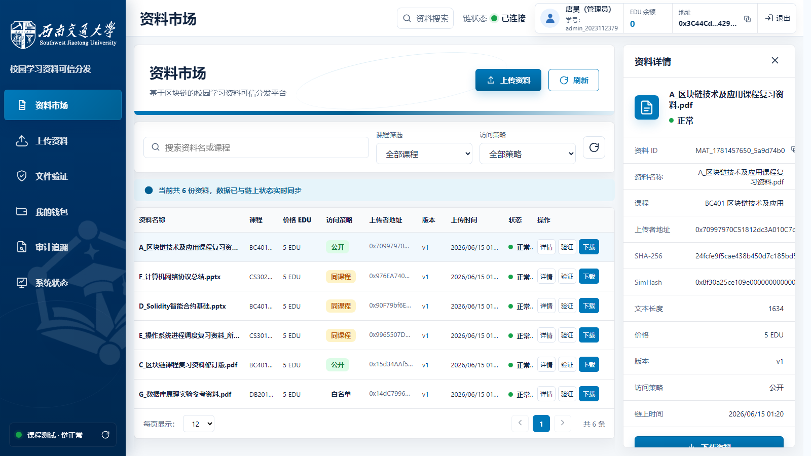
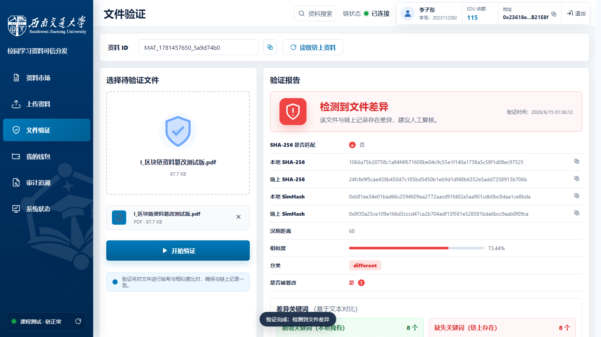
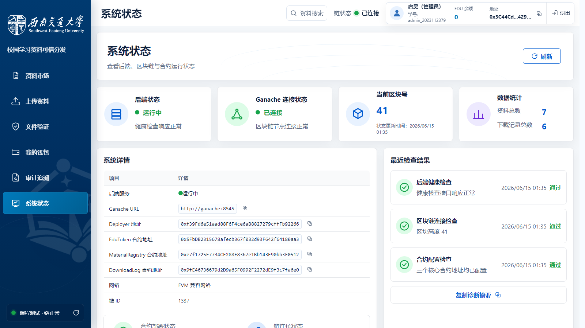
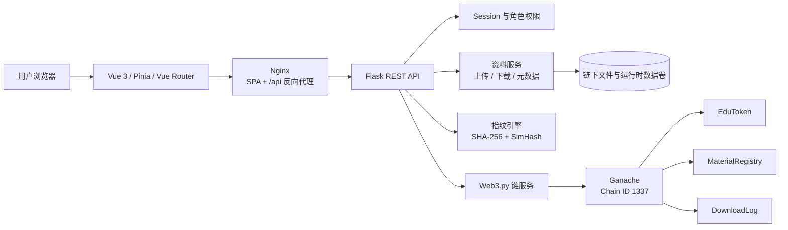

<p align="center">
  
</p>

<h1 align="center">校园学习资料可信交换与区块链存证平台</h1>

<p align="center">
  面向高校课程实验场景，将资料存证、内容验证、通证激励与审计追溯组织成一套可运行、可验证、可演示的区块链应用。
</p>

<p align="center">
  <a href="#快速开始"><strong>快速开始</strong></a>
  ·
  <a href="#系统实景"><strong>系统实景</strong></a>
  ·
  <a href="#系统架构"><strong>系统架构</strong></a>
  ·
  <a href="#测试与验证"><strong>测试结果</strong></a>
  ·
  <a href="#文档导航"><strong>项目文档</strong></a>
</p>

<p align="center">
  
  
  
  
  
</p>

<p align="center">
  
  
  
  
  
</p>

---

## 项目简介

EduChain 是一套面向校园学习资料交换场景的区块链课程项目。它没有把文件本体强行写入区块链，而是采用更适合实验原型的混合架构：

- **链下保存文件与业务元数据**，满足文档上传、检索和下载需求。
- **链上保存内容指纹、版本、价格、余额与审计事件**，形成可复核凭证。
- **SHA-256 与 SimHash 双指纹协同**，同时处理完整性校验和内容相似性分析。
- **EDU 通证驱动贡献与交换**，将上传奖励、资料支付、转账和管理员调控连接起来。

项目延续西南交通大学品牌视觉，前端采用统一的深蓝侧栏、顶部身份区、卡片、数据表格和状态语义，形成完整的高校科技平台风格。

> [!IMPORTANT]
> EduChain 当前定位为课程实验原型。系统使用 Ganache 测试链、固定测试账号和实验通证，不应承载真实资产、隐私文件或生产业务。

## 项目亮点

| 能力 | 实现方式 | 可验证结果 |
| :--- | :--- | :--- |
| 可信存证 | SHA-256、SimHash 和资料元数据登记到 `MaterialRegistry` | 可查询资料 ID、上传者、版本、指纹、价格和交易 |
| 内容验证 | 比较本地文件与链上双指纹，计算汉明距离和关键词差异 | 原件匹配度 100%；篡改样本被识别为 `different` |
| 通证闭环 | `EduToken` 提供首次奖励、上传奖励、下载支付、转账、奖励和扣罚 | 余额变化与 Transfer 事件可逐项核对 |
| 权限控制 | 支持公开、同课程和白名单访问策略 | 合法下载成功，越权和未登录请求被拦截 |
| 审计追溯 | `DownloadLog` 保存下载者、资料、金额、区块与交易信息 | 可按资料、用户或全局范围查询 |
| 可重复部署 | Docker Compose 编排 Ganache、Flask、Vue/Nginx | 合约自动部署或复用，命名卷保存链与文件状态 |

## 系统实景

下列页面均来自 2026 年 6 月 15 日的公网九账号联动测试，不是静态设计稿。

| 资料市场与链上详情 | 文件篡改检测 |
| :---: | :---: |
|  |  |

<p align="center">
  
</p>

## 核心功能

| 页面 | 路由 | 主要能力 |
| :--- | :--- | :--- |
| 登录系统 | `/login` | Session 登录、错误提示、后端与链连接检查 |
| 资料市场 | `/market` | 检索筛选、链上详情、策略标签、下载与验证入口 |
| 上传资料 | `/upload` | 文档解析、双指纹计算、重复拦截、相似提示和链上登记 |
| 文件验证 | `/verify` | SHA-256、SimHash、汉明距离、相似度和差异关键词 |
| 我的钱包 | `/wallet` | EDU 余额、链上流水、转账及管理员奖励与扣罚 |
| 审计追溯 | `/audit` | 上传记录、下载记录、资料审计与管理员全局审计 |
| 系统状态 | `/status` | 后端、Ganache、区块高度、合约地址和数据统计 |

### 资料存证与验证

系统支持 `.pdf`、`.docx`、`.pptx`、`.txt` 和 `.md` 文件，单文件上限为 50 MB。

1. 后端校验文件类型和大小。
2. 对原始字节计算 SHA-256，拦截完全重复文件。
3. 提取文本并计算 256 位 SimHash，分析内容相似程度。
4. 将资料 ID、双指纹、上传者、价格、策略和版本写入链上。
5. 保存链下文件，向上传者发放 20 EDU 奖励。

| 汉明距离 | 分类 | 说明 |
| :---: | :--- | :--- |
| `0` | `identical` | 内容指纹完全一致 |
| `1-12` | `highly_similar` | 内容高度相似 |
| `13-40` | `derived` | 可能属于修订或衍生版本 |
| `> 40` | `different` | 内容差异较大 |

### EDU 通证机制

- 普通学生首次成功登录获得 100 EDU，重复登录不会再次铸造。
- 资料完成链上登记后，上传者获得 20 EDU。
- 下载者按照资料价格向上传者支付 EDU。
- 用户可以执行普通转账并查询链上 Transfer 事件。
- 管理员可以奖励、扣罚和删除违规资料。
- EDU 使用整数积分，`decimals()` 返回 `0`。

### 权限与审计

- Flask Session 保存登录态，Vue Router 保护业务路由。
- 下载前检查登录状态、资料状态、课程或白名单策略、余额和服务端文件哈希。
- 服务器模式关闭公开注册，仅允许预置账号登录。
- 支付与审计由后端串行编排，失败时通过交易重查与退款补偿维持一致性。
- 管理员全局审计、奖励、扣罚和删除接口均执行角色校验。

## 系统架构



### 链上与链下边界

| 数据 | 存储位置 | 原因 |
| :--- | :--- | :--- |
| 文件本体 | Docker `upload_data` 卷 | 文件体积较大，需要支持直接下载 |
| 用户、课程与钱包映射 | `runtime_data` 卷 | 属于可维护的业务身份数据 |
| 可编辑名称和策略元数据 | `runtime_data` 卷 | 支持所有者更新并在重启后恢复 |
| SHA-256、SimHash、版本和上传者 | `MaterialRegistry` | 提供稳定的资料凭证 |
| EDU 余额和交易事件 | `EduToken` | 形成透明的激励与支付记录 |
| 下载者、资料和支付金额 | `DownloadLog` | 提供不可随意修改的审计依据 |

### 三份核心合约

| 合约 | 职责 |
| :--- | :--- |
| `EduToken.sol` | 整数 EDU 通证、转账、铸造、销毁和 Transfer 事件 |
| `MaterialRegistry.sol` | 资料登记、版本、双指纹、访问策略、下载支付和软删除 |
| `DownloadLog.sol` | 下载审计写入及按资料、用户、全局范围查询 |

## 技术栈

| 层次 | 技术与版本 | 用途 |
| :--- | :--- | :--- |
| 前端 | Vue `3.4+`、Vue Router `4.3+`、Pinia `2.1+` | 页面、路由、会话状态与交互 |
| 前端构建 | Vite `5.4+`、Node.js `20` | 开发服务器与生产构建 |
| 前端交付 | Nginx Alpine | SPA 回退、静态资源缓存和 `/api` 代理 |
| 后端 | Python `3.10`、Flask `3.1.1`、Gunicorn `23.0.0` | REST API、Session、业务编排与并发请求 |
| 区块链交互 | Web3.py `6.20.1` | 签名交易、回执、事件和合约状态查询 |
| 智能合约 | Solidity `0.8.28`、OpenZeppelin `5.1.0` | 通证、资料登记和审计合约 |
| 实验链 | Ganache `7.9.2`、Chain ID `1337` | 固定账户、交易、区块和事件 |
| 内容处理 | PyPDF2、python-docx、python-pptx、jieba | 文本提取、分词和内容指纹 |
| 部署 | Docker、Docker Compose、命名卷 | 三服务编排与持久化 |
| 测试 | pytest、Node Test Runner、并发联动脚本 | 后端回归、前端守卫与公网验证 |

## 项目结构

```text
EduChain/
├── contracts/                    # EduToken、MaterialRegistry、DownloadLog
├── scripts/                      # 合约编译、部署、测试账号和报告脚本
├── backend/
│   ├── app.py                    # Flask 应用工厂与健康检查
│   ├── entrypoint.sh             # 等待链、部署合约、初始化账号、启动服务
│   ├── routes/                   # auth / material / token / audit API
│   ├── services/                 # 链、资料、用户和通证服务
│   ├── fingerprint/              # 文档解析、SHA-256 与 SimHash
│   ├── compiled/                 # 合约 ABI 与 Bytecode
│   └── tests/                    # 后端回归测试
├── frontend/
│   ├── src/
│   │   ├── components/           # 统一应用框架与公共组件
│   │   ├── views/                # 七个主要页面
│   │   ├── stores/               # Pinia 会话状态
│   │   ├── router/               # 页面路由与登录守卫
│   │   └── assets/               # 品牌图片与全局样式
│   ├── tests/                    # 前端状态与设计守卫测试
│   ├── Dockerfile
│   └── nginx.conf
├── demo/                         # 原件与篡改样本
├── docs/                         # 设计、部署、测试、报告与证据
├── docker-compose.yml            # 本地演示环境
└── docker-compose.server.yml     # 公网课程测试环境
```

## 快速开始

### 环境要求

- Docker Desktop，或 Linux 上的 Docker Engine 与 Compose Plugin
- 建议为 Docker 分配至少 4 GB 内存
- 首次构建需要能够下载基础镜像和依赖

### 一键启动

在项目根目录执行：

```powershell
docker compose up --build -d
```

容器入口会自动完成以下工作：

1. 启动 Ganache 并等待节点就绪。
2. 检查已保存的合约地址和链上代码。
3. 合约不存在或失效时自动部署三份合约。
4. 初始化预置测试账号与钱包映射。
5. 启动 Flask 后端和 Vue/Nginx 前端。

启动完成后访问：

| 服务 | 地址 |
| :--- | :--- |
| EduChain 前端 | `http://localhost:8080` |
| 后端健康检查 | `http://localhost:5000/api/health` |
| Ganache RPC | `http://localhost:8545` |

检查容器和日志：

```powershell
docker compose ps
docker compose logs --tail=100 backend
```

停止服务：

```powershell
docker compose down
```

> [!CAUTION]
> `docker compose down -v` 会删除链数据、EDU 余额、合约地址、上传文件和运行时账号。除非确实需要完全重置实验环境，否则不要添加 `-v`。

### 服务器测试模式

服务器模式仅向公网映射 Nginx 的 `80` 端口，后端 `5000` 和 Ganache `8545` 仅在 Docker 网络内可见。

```powershell
Copy-Item .env.server.example .env.server
docker compose --env-file .env.server -f docker-compose.server.yml up --build -d
```

部署前应修改 `.env.server` 中的 `SECRET_KEY`。完整流程见 [服务器部署说明](docs/SERVER_DEPLOYMENT.md)。

## 账号与测试

### 演示账号

服务器课程测试模式预置八个学生账号和一个管理员账号，统一测试密码为 `123456`。

<details>
<summary><strong>展开查看九个测试账号</strong></summary>

| 账号 | 姓名 | 角色 | 课程 |
| :--- | :--- | :---: | :--- |
| `2023112379` | 唐昊 | 学生 | BC401、AI301 |
| `admin_2023112379` | 唐昊（管理员） | 管理员 | 全局管理 |
| `2023112385` | 薛雨凇 | 学生 | BC401、CS201 |
| `2023112380` | 于骐畅 | 学生 | BC401、CS302 |
| `2023112318` | 周子皓 | 学生 | BC401、CS301 |
| `2023112330` | 王东涵 | 学生 | CS302、DB201 |
| `2023116100` | 谢傲宇 | 学生 | BC401、DB201 |
| `2023112392` | 李子彤 | 学生 | BC401、AI301 |
| `2023112317` | 方天宇 | 学生 | BC401、CS201、CS301 |

</details>

> 测试账号、固定助记词和私钥只能用于隔离的 Ganache 实验链，不得用于真实网络或真实资产。

## 测试与验证

### 最终验证结果

| 验证层次 | 结果 | 覆盖范围 |
| :--- | :---: | :--- |
| 前端守卫测试 | **14 / 14** | 七页面路由、统一框架、真实 API、交互处理和 README 账号约束 |
| 后端回归测试 | **32 passed** | 认证、签名交易、指纹、资料、通证、审计、补偿与服务器模式 |
| 公网九账号联动 | **47 / 47** | 并发登录、上传、查重、验证、权限下载、支付、管理与审计 |
| 文件验证 | **原件 100%** | SHA-256 匹配，汉明距离 `0`，分类 `identical` |
| 篡改检测 | **成功识别** | SHA-256 不匹配，汉明距离 `68`，相似度 `73.44%` |
| 并发下载 | **6 成功 / 3 拒绝** | 公开、同课程、白名单和三类越权场景 |
| 重启恢复 | **通过** | 区块、合约、7 份资料、审计、元数据、删除标记和文件均保留 |
| 端口隔离 | **通过** | 公网仅开放前端 80，5000 与 8545 不直接暴露 |

公网主测试于 **2026 年 6 月 15 日 01:20:42 至 01:21:42（UTC+8）** 执行，用时约 60 秒，未发现阻断性问题。

完整证据：

- [公网九账号联动测试报告](docs/test_results/public_joint_test_final_20260615_012041/TEST_REPORT.md)
- [部署后补充验证记录](docs/test_results/public_joint_test_final_20260615_012041/POST_DEPLOYMENT_VERIFICATION.md)
- [原始测试结果 JSON](docs/test_results/public_joint_test_final_20260615_012041/joint_test_results.json)
- [区块链课程项目报告](docs/EduChain_区块链课程项目报告_最终完善版.docx)

### 本地验证命令

前端设计与状态回归：

```powershell
npm run test:frontend
```

Vue 生产构建：

```powershell
Set-Location frontend
npm install
npm run build
```

后端回归测试：

```powershell
# 链服务相关用例需要 Ganache 与合约已经就绪
docker compose up --build -d
$env:PYTEST_DISABLE_PLUGIN_AUTOLOAD = "1"
.\.venv\Scripts\python.exe -m pytest backend\tests -q
```

合约重新编译：

```powershell
npm install
npm run compile
```

## API 概览

接口统一使用 `/api` 前缀，并通过 Flask Session 识别当前用户。

<details>
<summary><strong>展开查看主要 REST API</strong></summary>

| 分组 | 方法与路径 | 说明 |
| :--- | :--- | :--- |
| 系统 | `GET /api/health` | 后端、区块链、合约、账号和数据统计 |
| 认证 | `POST /api/auth/login` | 用户登录与首次 EDU 奖励 |
| 认证 | `GET /api/auth/me` | 查询当前会话 |
| 认证 | `POST /api/auth/logout` | 注销当前会话 |
| 资料 | `POST /api/material/upload` | 上传、提取文本、查重与链上登记 |
| 资料 | `GET /api/material/list` | 查询资料列表 |
| 资料 | `GET /api/material/<id>` | 查询资料详情 |
| 资料 | `GET /api/material/<id>/download` | 权限检查、支付、审计与文件下载 |
| 资料 | `POST /api/material/verify` | 对比本地文件与链上指纹 |
| 通证 | `GET /api/token/balance` | 查询 EDU 余额 |
| 通证 | `GET /api/token/history` | 查询链上通证流水 |
| 通证 | `POST /api/token/transfer` | 普通用户转账 |
| 通证 | `POST /api/token/reward` | 管理员奖励 |
| 通证 | `POST /api/token/penalize` | 管理员扣罚 |
| 审计 | `GET /api/audit/downloads/all` | 管理员全局下载审计 |
| 审计 | `GET /api/audit/full/<id>` | 查询资料完整审计信息 |

</details>

统一响应示例：

```json
{
  "code": 200,
  "msg": "success",
  "data": {}
}
```

## 当前边界

- 当前区块链为单节点 Ganache，不代表生产级联盟链或公链部署。
- 文件本体保存在链下，链上负责保存可信指纹、通证状态和审计事件。
- 固定助记词、统一测试密码和自动派生钱包只适合课程测试环境。
- 服务器测试版使用 HTTP，正式环境需要 HTTPS、正式身份认证和密钥托管。
- 支付与审计目前由两份合约和后端补偿逻辑编排，不等同于单笔原子事务。
- SimHash 用于辅助判断文本相似性，不能替代人工学术审查。
- 扫描版 PDF 或图片型课件没有稳定文本层时，需要额外接入 OCR。

## 文档导航

| 文档 | 内容 |
| :--- | :--- |
| [前端设计系统](frontend/DESIGN_SYSTEM.md) | 品牌色、布局、组件和交互约束 |
| [系统架构说明](docs/architecture.md) | 模块边界、调用关系和部署结构 |
| [API 规格](docs/api_spec.md) | 接口契约与响应结构 |
| [数据模型](docs/data_model.md) | 链上与链下对象设计 |
| [合约规格](docs/contracts_spec.md) | 三份智能合约的状态与方法 |
| [指纹方案](docs/fingerprint_spec.md) | SHA-256、SimHash 和分类规则 |
| [服务器部署说明](docs/SERVER_DEPLOYMENT.md) | 公网课程测试部署与安全边界 |
| [测试账号手册](docs/TEST_ACCOUNT_MANUAL.md) | 九账号身份、课程和分工 |
| [联动测试手册](docs/JOINT_TEST_MANUAL.md) | 多账号协作测试步骤 |
| [演示流程](docs/demo.md) | 课程验收与功能演示顺序 |
| [系统限制](docs/limitations.md) | 已知限制与后续改进方向 |

---

<p align="center">
  
</p>

<p align="center">
  <strong>EduChain</strong><br>
  让资料的来源、内容、交换与审计都留下可验证的证据。
</p>
