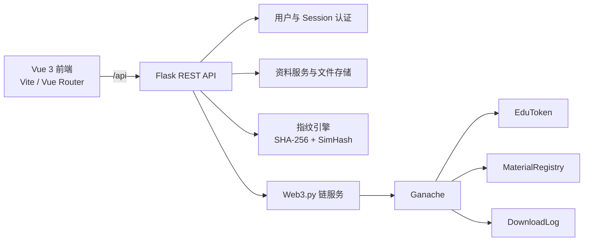

# EduChain

## 校园学习资料可信交换与区块链存证平台

EduChain 是一个面向高校教学实验场景的区块链应用原型，用于完成学习资料上传、链上存证、可信验证、付费下载、EDU 通证激励和审计追溯。

项目目前已完成智能合约、Flask REST API、Vue 3 前端主要页面和 Docker Compose 部署框架，当前阶段重点是前后端业务联调、真实链上数据替换和端到端测试。

> 当前定位：可运行的课程设计/实验原型，尚不适合直接用于生产环境。

## 当前进度

更新时间：2026-06-09

| 模块 | 状态 | 当前说明 |
| :--- | :---: | :--- |
| 智能合约 | 已完成 | `EduToken`、`MaterialRegistry`、`DownloadLog` 已实现，可编译和部署到 Ganache |
| 内容指纹 | 已完成 | 支持 SHA-256 完整性校验与 256 位 SimHash 内容相似度检测 |
| 后端服务层 | 已完成 | 链交互、用户、资料、通证和指纹服务已实现 |
| REST API | 基本完成 | 认证、资料、钱包、审计和健康检查蓝图已接入 Flask |
| Vue 前端页面 | 已完成 | 登录、资料市场、上传、验证、钱包、审计追溯、系统状态共 7 个页面 |
| 设计系统 | 已完成 | 页面统一遵循 `frontend/DESIGN_SYSTEM.md`，使用西南交大蓝和统一后台布局 |
| 前后端联调 | 进行中 | 已有统一 API 请求封装，但当前主要页面仍以演示数据和前端交互逻辑为主 |
| 自动化测试 | 部分完成 | 已有认证、指纹、链服务、通证和签名交易测试，部分测试依赖 Ganache 与已部署合约 |
| Docker 部署 | 基本完成 | 支持 Ganache、Flask、Vue/Nginx 一键编排，后端启动时会检查并部署合约 |

综合来看，项目已进入“功能整合与联调”阶段。界面和后端能力均已成型，后续工作的重点不是继续补静态页面，而是让页面数据、登录态、上传下载和链上交易全部走真实 API。

## 已完成页面

前端使用 Vue 3、Vue Router 和 Vite 构建。

| 路由 | 页面 | 当前能力 |
| :--- | :--- | :--- |
| `/login` | 登录系统 | 表单校验、错误状态、演示登录流程 |
| `/market` | 资料市场 | 搜索筛选、资料列表、详情面板、分页和状态展示 |
| `/upload` | 上传资料 | 文件选择、类型/大小校验、课程与策略配置、上传结果和相似资料展示 |
| `/verify` | 文件验证 | 待验证文件选择、资料 ID、验证报告、相似度及差异关键词展示 |
| `/wallet` | 我的钱包 | EDU 余额、钱包信息、交易筛选、交易历史和近期统计 |
| `/audit` | 审计追溯 | 我的下载、我的上传、资料下载记录、查询、分页和管理员权限提示 |
| `/status` | 系统状态 | 后端、Ganache、区块、合约、数据统计和检查记录展示 |

当前登录页的前端演示账号为：

```text
学号：20240001
密码：password123
```

该账号仅用于前端页面演示。后端认证使用 `backend/users.json` 中的本地用户，默认密码规则以 `user_service` 和测试代码为准。目前前端登录页尚未正式接入 `/api/auth/login`。

## 系统架构



Docker 部署时，Nginx 托管 Vue 构建产物并将 `/api/` 反向代理到 Flask。后端入口脚本会等待 Ganache 就绪，检查合约是否有效，并在需要时自动执行部署。

## 核心功能

### 资料可信存证

- 上传 PDF、DOCX、PPTX、TXT、MD 文件。
- 计算文件 SHA-256，判断文件字节是否完全一致。
- 提取文本并生成 256 位 SimHash，判断内容相似程度。
- 将资料 ID、上传者、哈希、内容指纹、价格、版本和访问策略写入链上。

### 文件验证

| 判断依据 | 用途 |
| :--- | :--- |
| SHA-256 | 判断文件是否被修改 |
| SimHash | 判断内容是否高度相似或属于衍生版本 |
| 汉明距离 | 量化两个 SimHash 之间的差异 |

当前分类规则：

| 汉明距离 | 分类 |
| :--- | :--- |
| `0` | 完全一致 |
| `1-12` | 高度相似 |
| `13-40` | 衍生版本 |
| `>40` | 差异较大 |

### EDU 通证

- 首次登录注册奖励：100 EDU。
- 成功上传资料奖励：20 EDU。
- 下载资料时由下载者向上传者支付 EDU。
- 支持铸造、授权、转账、销毁和交易历史查询。
- EDU 当前设置为整数积分，`decimals()` 返回 `0`。

### 权限与审计

- Session 登录态与 `login_required` 权限控制。
- 学生只能访问与自身相关的记录。
- 全局审计接口由 `admin_required` 限制。
- 下载行为通过 `DownloadLog` 合约记录，可按资料或用户查询。
- 访问策略支持公开和同课程；白名单策略仍属于预留能力。

## 技术栈

| 层次 | 技术 |
| :--- | :--- |
| 前端 | Vue 3、Vue Router、Pinia、Vite |
| 样式 | 原生 CSS、项目设计系统 |
| 后端 | Python 3、Flask、Flask-CORS |
| 区块链交互 | Web3.py |
| 智能合约 | Solidity、OpenZeppelin |
| 本地测试链 | Ganache，Chain ID `1337` |
| 内容处理 | PyPDF2、python-docx、python-pptx、jieba |
| 部署 | Docker Compose、Nginx |

## API 概览

所有接口统一使用 `/api` 前缀。

### 系统

| 方法 | 路径 | 说明 |
| :--- | :--- | :--- |
| GET | `/api/health` | 后端、Ganache、区块、合约和数据统计 |

### 认证

| 方法 | 路径 | 说明 |
| :--- | :--- | :--- |
| POST | `/api/auth/login` | 学号和密码登录，建立 Session |
| POST | `/api/auth/logout` | 清除登录态 |
| GET | `/api/auth/me` | 获取当前用户和实时 EDU 余额 |

### 资料

| 方法 | 路径 | 说明 |
| :--- | :--- | :--- |
| POST | `/api/material/upload` | 上传资料并完成指纹计算及链上注册 |
| GET | `/api/material/list` | 查询、筛选和分页获取资料 |
| GET | `/api/material/<id>` | 获取资料详情 |
| POST | `/api/material/<id>/download` | 扣费并下载文件 |
| POST | `/api/material/<id>/verify` | 上传本地文件并与链上资料比对 |
| DELETE | `/api/material/<id>` | 上传者软删除资料 |

### 通证

| 方法 | 路径 | 说明 |
| :--- | :--- | :--- |
| GET | `/api/token/balance` | 查询当前用户 EDU 余额 |
| GET | `/api/token/transactions` | 分页查询当前用户交易历史 |

### 审计

| 方法 | 路径 | 说明 |
| :--- | :--- | :--- |
| GET | `/api/audit/downloads/<material_id>` | 按资料查询下载记录 |
| GET | `/api/audit/user/<address>` | 按地址查询下载记录 |
| GET | `/api/audit/my-downloads` | 当前用户的下载记录 |
| GET | `/api/audit/my-uploads` | 当前用户上传的资料 |
| GET | `/api/audit/all` | 全局下载记录，仅管理员可访问 |

更详细的请求和响应格式参见 `docs/api_spec.md`。

## 项目结构

```text
EduChain/
├── contracts/                 # Solidity 智能合约
│   ├── EduToken.sol
│   ├── MaterialRegistry.sol
│   └── DownloadLog.sol
├── backend/
│   ├── app.py                 # Flask 应用入口与蓝图注册
│   ├── entrypoint.sh          # 容器启动、链检查和自动部署
│   ├── routes/                # auth/material/token/audit API
│   ├── services/              # 用户、链、资料、通证服务
│   ├── fingerprint/           # 文本提取与指纹计算
│   ├── tests/                 # 后端及链上能力测试
│   ├── compiled/              # 合约 ABI 与字节码
│   └── uploads/               # 本地上传文件
├── frontend/
│   ├── src/
│   │   ├── views/             # 七个主要业务页面
│   │   ├── router/            # Vue Router
│   │   ├── stores/            # Pinia 状态
│   │   ├── utils/api.js       # API 与 Web Crypto 工具
│   │   └── assets/            # 样式和品牌图片
│   ├── public/                # favicon 等公共资源
│   ├── DESIGN_SYSTEM.md       # 前端设计规范
│   ├── Dockerfile
│   └── nginx.conf
├── scripts/
│   ├── compile.js             # 编译合约
│   └── deploy.py              # 部署合约并写入配置
├── docs/                      # 架构、API、合约和数据模型文档
├── docker-compose.yml
├── requirements.txt
└── package.json
```

## 快速开始

### 方式一：Docker Compose

建议使用 Docker 启动完整环境：

```powershell
docker compose up --build
```

启动后访问：

- 前端：`http://localhost:8080`
- 后端健康检查：`http://localhost:5000/api/health`
- Ganache RPC：`http://localhost:8545`

后端容器会自动等待 Ganache，检查已部署合约；若合约不存在或失效，会自动运行 `scripts/deploy.py`。

停止服务：

```powershell
docker compose down
```

如需同时清理 Ganache 和上传文件卷：

```powershell
docker compose down -v
```

### 方式二：本地开发

#### 1. 安装并编译合约

```powershell
npm install
npm run compile
```

#### 2. 安装 Python 依赖

```powershell
python -m venv .venv
.\.venv\Scripts\Activate.ps1
pip install -r requirements.txt
```

#### 3. 启动 Ganache 并部署合约

确保 Ganache 运行在 `http://127.0.0.1:8545`，然后执行：

```powershell
python scripts/deploy.py
```

部署结果会写入 `backend/.env`。

#### 4. 启动后端

```powershell
cd backend
python app.py
```

后端默认运行在 `http://localhost:5000`。

#### 5. 启动前端

另开一个终端：

```powershell
cd frontend
npm install
npm run dev
```

前端默认运行在 `http://localhost:5173`，Vite 会将 `/api` 代理到 `http://localhost:5000`。

### 生产构建

```powershell
cd frontend
npm run build
```

构建产物位于 `frontend/dist/`。

## 测试

部分测试需要 Ganache 已启动并且合约已部署。

```powershell
cd backend
python -m tests.test_fingerprint
python -m tests.test_chain_service
python -m tests.test_token_service
python -m tests.test_p02_signing
python -m tests.test_auth
```

前端当前以生产构建作为基础校验：

```powershell
cd frontend
npm run build
```

## 当前限制与后续计划

### 当前限制

- 前端七个页面已经完成视觉和基础交互，但大部分业务数据仍为页面内演示数据。
- 前端登录目前使用演示账号判断，尚未接入真实 Session 登录接口。
- 资料市场、上传、验证、钱包、审计和状态页尚需逐页替换为真实 API 数据。
- 页面侧栏和顶栏在各视图中存在重复实现，后续应统一回收至共享组件。
- 白名单访问策略尚未实现完整业务闭环。
- 当前用户和私钥配置仅适用于本地 Ganache 演示，不能用于公网或生产环境。
- 自动化测试尚未覆盖完整的前端到合约端到端流程。

### 下一阶段优先级

1. 接入 `/api/auth/login`、`/logout` 和 `/me`，统一前端登录态与路由保护。
2. 将资料市场、上传和验证页面接入真实资料 API。
3. 将钱包和审计页面接入链上余额、交易和下载记录。
4. 将系统状态页接入 `/api/health`，替换静态统计数据。
5. 抽取统一的后台 Layout、Sidebar、Header、复制按钮和分页组件。
6. 增加端到端测试、异常状态、加载状态和空状态覆盖。
7. 清理演示私钥和本地数据，补充生产环境安全配置。

## 文档

- `frontend/DESIGN_SYSTEM.md`：前端设计系统与页面规范。
- `docs/architecture.md`：系统架构与数据流。
- `docs/api_spec.md`：API 设计与请求响应说明。
- `docs/contracts_spec.md`：智能合约接口。
- `docs/fingerprint_spec.md`：指纹算法与相似度规则。
- `docs/data_model.md`：链上和链下数据模型。
- `docs/frontend_design_prompt.md`：前端设计稿复刻与开发背景。
- `CLAUDE.md`：开发协作事实、约束与项目说明。

## 安全说明

仓库中的 Ganache 助记词、演示账户和私钥仅用于本地开发。不要在公网链、测试网资产账户或生产环境中复用这些信息。
