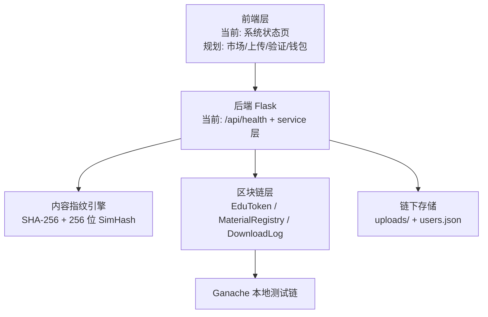

# EduChain

## 面向校园学习资料共享的区块链可信分发原型系统

EduChain 是一个仍在开发中的校园学习资料可信交换原型系统，聚焦两个核心问题：

1. 资料可信：通过链上存证记录资料哈希、内容指纹、上传者和下载日志。
2. 共享激励：通过 EduToken 通证机制奖励注册、上传，并支持下载付费和扣罚预留。

当前仓库已经完成合约层、后端 service 层、内容指纹模块和健康检查页；完整 REST 路由和业务前端页面仍在接入中。本文档以当前代码为准，早期方案中的完整页面、完整 API 和演示脚本属于后续目标。

## 当前完成度

### 已实现

- 智能合约：`EduToken`、`MaterialRegistry`、`DownloadLog`。
- 合约编译部署：`scripts/compile.js` 编译，`scripts/deploy.py` 部署并写入 `backend/.env`。
- 后端入口：Flask 应用工厂与 `/api/health` 健康检查接口。
- 后端服务层：链交互、资料编排、通证操作、用户初始化与私钥注入。
- 内容指纹：SHA-256 文件完整性校验 + 256 位 SimHash 内容相似度检测。
- 前端：`frontend/index.html` 系统状态页，调用 `/api/health`。
- 测试脚本：指纹、链服务、通证服务、签名交易闭环验证。

### 尚未完成

- `backend/routes/` 尚未接入，`/api/auth`、`/api/material`、`/api/token`、`/api/audit` 仍是规划接口。
- 资料市场页、上传页、验证报告页、钱包页尚未完成。
- 白名单访问策略 `policy_type=2` 仍是预留逻辑。
- 前端 Web Crypto 二次校验、关键词差异展示、完整交易时间线还未接入 UI。

## 技术栈

| 层次 | 当前选型 | 说明 |
| :--- | :--- | :--- |
| 前端 | HTML / CSS / Vanilla JS | 当前只有健康检查页，原型阶段不引入 React/Vue |
| 后端 | Python + Flask | 应用入口、服务层、指纹计算、链交互 |
| 区块链交互 | Web3.py | 后端统一通过 `chain_service.py` 访问合约 |
| 智能合约 | Solidity `^0.8.20` + OpenZeppelin | ERC-20 通证、资料注册、下载日志 |
| 合约编译 | `solc` + Node.js 脚本 | `npm run compile` 输出 ABI 到 `backend/compiled/` |
| 测试链 | Ganache | 本地 Ethereum 测试环境 |
| 内容提取 | `python-pptx` / `python-docx` / `PyPDF2` | 提取 PPT、Word、PDF 文本 |
| 中文分词 | `jieba.analyse` | TF-IDF 关键词提取 |
| 内容指纹 | 256 位 SimHash | 使用 SHA-256 作为关键词哈希基函数 |
| 部署 | Docker Compose | Ganache + Flask 后端 + Nginx 静态前端 |

## 系统架构



当前实际 HTTP 流程：

```text
frontend/index.html
  -> GET /api/health
  -> chain_service 查询 Ganache、合约地址、资料数、下载记录数
  -> 前端展示系统状态
```

上传、下载、验证等业务流程已经在 `backend/services/material_service.py` 中形成 service 编排，但尚未暴露为 REST API。

## 核心设计

### 双层内容指纹

| 指纹 | 当前实现 | 用途 |
| :--- | :--- | :--- |
| SHA-256 | 对文件原始字节分块计算 | 判断文件是否比特级完全一致 |
| SimHash | 对提取文本计算 256 位内容指纹 | 量化内容相似度，辅助识别微改、衍生版本或明显差异 |

当前 SimHash 分类：

| 汉明距离 d | 分类 | 含义 |
| :--- | :--- | :--- |
| `0` | `identical` | 内容指纹完全一致 |
| `1-12` | `high` | 高度相似 |
| `13-40` | `derived` | 衍生版本或明显改写 |
| `>40` | `different` | 差异较大 |

### EduToken 通证机制

当前代码中的通证能力包括：

- `mint()` / `mintWithReason()`：铸造 EDU。
- `burnFrom()`：销毁 EDU，用于抄袭扣罚等预留场景。
- `approve()` / `transferFrom()`：下载扣费授权和转移。
- `decimals()` 返回 `0`，EDU 是整数积分。
- `authorizeMinter()` 授权 `MaterialRegistry` 在上传注册时铸造 20 EDU 奖励。

当前经济参数在代码中体现为：

| 行为 | EDU 变化 | 当前状态 |
| :--- | :--- | :--- |
| 注册奖励 | +100 EDU | `token_service.reward_register()` 已实现 |
| 上传奖励 | +20 EDU | `MaterialRegistry.register()` 内部 mint |
| 下载付费 | 下载者 -> 上传者 | `MaterialRegistry.download()` 使用 `transferFrom()` |
| 抄袭扣罚 | 销毁最多 50 EDU | `token_service.penalize_plagiarism()` 已实现为 service |

## 合约概览

### EduToken

继承 OpenZeppelin `ERC20` 和 `Ownable`，当前构造函数固定为 `EduToken` / `EDU`。

核心接口：

- `authorizeMinter(address minter)`
- `revokeMinter(address minter)`
- `mint(address to, uint256 amount)`
- `mintWithReason(address to, uint256 amount, string reason)`
- `burnFrom(address from, uint256 amount, string reason)`
- ERC-20 标准 `transfer`、`approve`、`transferFrom`、`balanceOf`、`allowance`

### MaterialRegistry

记录资料元数据，链上字段包括：

- `id`
- `name`
- `course`
- `uploader`
- `sha256Hash`
- `simHash`，类型为 `uint256`
- `textLength`
- `policyType`
- `policyValue`
- `price`
- `version`
- `deleted`
- `timestamp`

当前没有完整历史版本数组，`update()` 会覆盖最新哈希/SimHash/文本长度并递增版本号。

### DownloadLog

当前下载记录字段：

- `materialId`
- `downloader`
- `uploader`
- `price`
- `fileHash`
- `timestamp`

接口包括 `recordDownload()`、`queryByMaterial()`、`queryByDownloader()` 和 `getRecordCount()`。

## 项目结构

```text
EduChain/
├── contracts/
│   ├── EduToken.sol
│   ├── MaterialRegistry.sol
│   └── DownloadLog.sol
├── backend/
│   ├── app.py
│   ├── config.py
│   ├── users.json
│   ├── compiled/
│   ├── fingerprint/
│   ├── services/
│   ├── tests/
│   └── utils/
├── frontend/
│   ├── index.html
│   └── nginx.conf
├── scripts/
│   ├── compile.js
│   └── deploy.py
└── docs/
```

## 快速开始

### 安装合约依赖

```powershell
npm install
```

### 编译合约

```powershell
npm run compile
```

编译产物会写入 `backend/compiled/`。

### 启动服务

```powershell
docker compose up --build
```

当前服务端口：

- Ganache: `8545`
- Backend: `5000`
- Frontend: `8080`

### 部署合约

```powershell
python scripts/deploy.py
```

部署脚本会写入 `backend/.env`，供后端初始化 `chain_service` 使用。

### 本地启动后端

```powershell
cd backend
python app.py
```

如果不在 Docker 内运行，需要确保 `GANACHE_URL` 指向本机 Ganache，例如 `http://127.0.0.1:8545`。

## 测试脚本

这些测试是脚本式验证，部分需要 Ganache 已启动且合约已部署。

```powershell
cd backend
python -m tests.test_fingerprint
python -m tests.test_chain_service
python -m tests.test_token_service
python -m tests.test_p02_signing
```

## 当前唯一可调用 API

### GET `/api/health`

返回后端、Ganache 和合约状态，例如：

```json
{
  "code": 200,
  "msg": "success",
  "data": {
    "status": "running",
    "ganache_connected": true,
    "ganache_url": "http://ganache:8545",
    "block_number": 1,
    "deployer": "0x...",
    "contracts": {
      "edu_token": "0x...",
      "material_registry": "0x...",
      "download_log": "0x..."
    },
    "material_count": 0,
    "download_count": 0
  }
}
```

后续 API 规划请看 `docs/api_spec.md`。

## 文档说明

- `CLAUDE.md`：面向开发协作的当前项目事实和约束。
- `docs/architecture.md`：当前架构和已实现数据流。
- `docs/contracts_spec.md`：当前合约接口。
- `docs/fingerprint_spec.md`：当前指纹算法。
- `docs/api_spec.md`：当前可调用 API 与后续路由目标。
- `docs/data_model.md`：当前链上/链下数据模型。
- `docs/基础方案.docx`：早期 PPT 方案草稿，已加状态说明；展示时应注意它包含规划内容。

## 项目定位总结

EduChain 的核心不是单纯上传下载文件，而是构建一个可以证明资料来源、检查内容是否被改、并用通证激励贡献的校园资料可信交换原型。

当前最稳妥的表述是：合约、service 层和指纹引擎已经具备基础能力；完整 API 与前端业务页面仍处于下一阶段集成开发。
